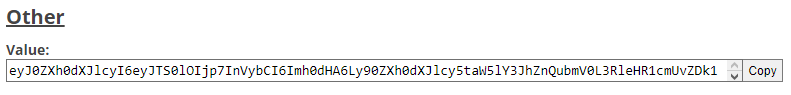

# ItemBuilder

***Version testing -> 1.8, 1.20***

## Example ONE
Create simple item with name and if you want lore (lore is optional)
```
private ItemStack EXAMPLE_ITEM_1 = ItemBuilder.create(Material.STONE, 1, "Example", lore);

private Inventory example1() {
    Inventory inventory = Bukkit.createInventory(null, 3*9, "Inventory example");
    inventory.setItem(0, EXAMPLE_ITEM_1);
    return inventory;
}
```
## Example TWO
Create simple item, modify data and if you want lore (lore is optional)
```
private ItemStack EXAMPLE_ITEM_2 = ItemBuilder.create(Material.WOOL, 1, 14, "Example");

private Inventory example2() {
    Inventory inventory = Bukkit.createInventory(null, 3*9, "Inventory example");
    inventory.setItem(0, EXAMPLE_ITEM_2);
    return inventory;
}
```
## Example THREE
Create simple skull item and if you want lore (lore is optional)
```
private ItemStack EXAMPLE_ITEM_3 = ItemBuilder.skull(1, "Example", "%PlayerName%");

private Inventory example3() {
    Inventory inventory = Bukkit.createInventory(null, 3*9, "Inventory example");
    inventory.setItem(0, EXAMPLE_ITEM_3);
    return inventory;
}
```
## Example FOUR
#### Create a cutom skull with custom skin
value is custom head : [Custom Heads](https://minecraft-heads.com/custom-heads) | 
take at the bottom of the page in other: 'value:'



**_Copy this and paste in value ↓_**
```
private ItemStack EXAMPLE_ITEM_4 = ItemBuilder.skullCustom(1, "Example", value);

private Inventory example4() {
    Inventory inventory = Bukkit.createInventory(null, 3*9, "Inventory example");
    inventory.setItem(0, EXAMPLE_ITEM_3);
    return inventory;
}
```